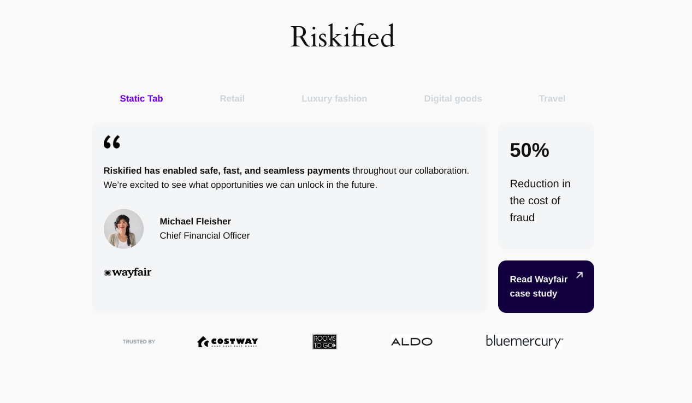

# Custom Tabs WordPress Plugin

Custom Tabs is a WordPress plugin that allows you to create and manage tabs with custom content via the WordPress admin panel.

## Features

- Create up to 6 custom tabs.
- Easily manage tab titles and content from the WordPress admin panel.
- Static first tab with customizable content.
- Responsive design with support for different image sizes.

## Installation

1. Download or clone the plugin from the [GitHub repository] (https://github.com/danimatuko/custom-tabs) to your plugins folder.
2. Run `npm install` to install the necessary dependencies.
3. Run `npm run build` to build the project.
4. Activate the plugin through the 'Plugins' screen in WordPress.
5. Navigate to `Custom Tabs` to configure your tabs.

## Usage

1. Navigate to `Custom Tabs` in the WordPress admin panel.
2. Enter the titles and content for up to 6 tabs.
3. Use the `[custom_tabs]` shortcode to display the tabs on any page or post.

## Shortcode

To display the custom tabs on a page or post, use the `[custom_tabs]` shortcode.

## Customization

You can customize the static tab content by editing the `templates/static-tab-content.php` file.

## License

This project is licensed under the MIT License. See the [LICENSE](LICENSE) file for details.

## Contributing

1. Fork the repository.
2. Create your feature branch (`git checkout -b feature/fooBar`).
3. Commit your changes (`git commit -am 'Add some fooBar'`).
4. Push to the branch (`git push origin feature/fooBar`).
5. Create a new Pull Request.

## Contact

For support and inquiries, please open an issue on the [GitHub repository](https://github.com/danimatuko/custom-tabs/issues).

---

Thank you for using the Custom Tabs WordPress plugin!
